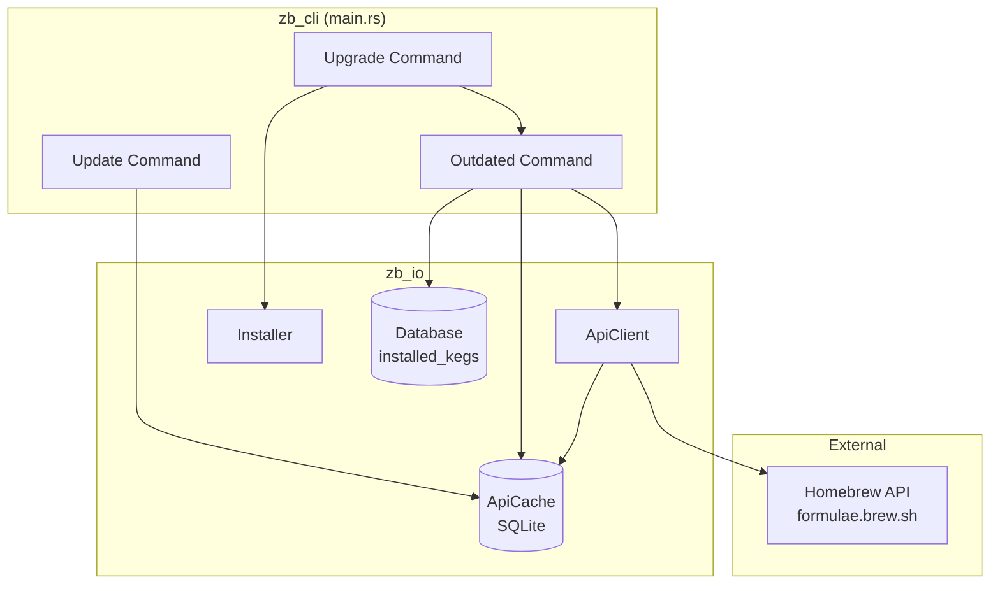
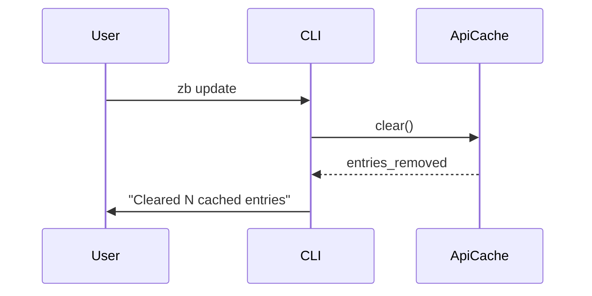
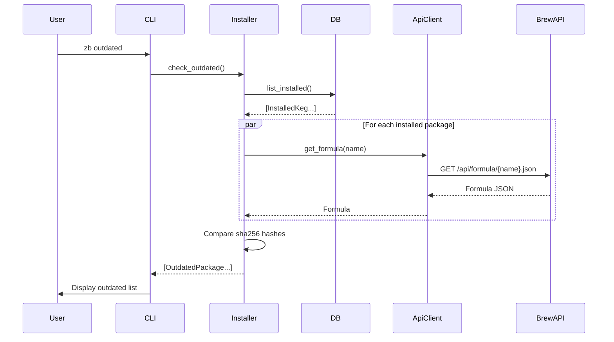
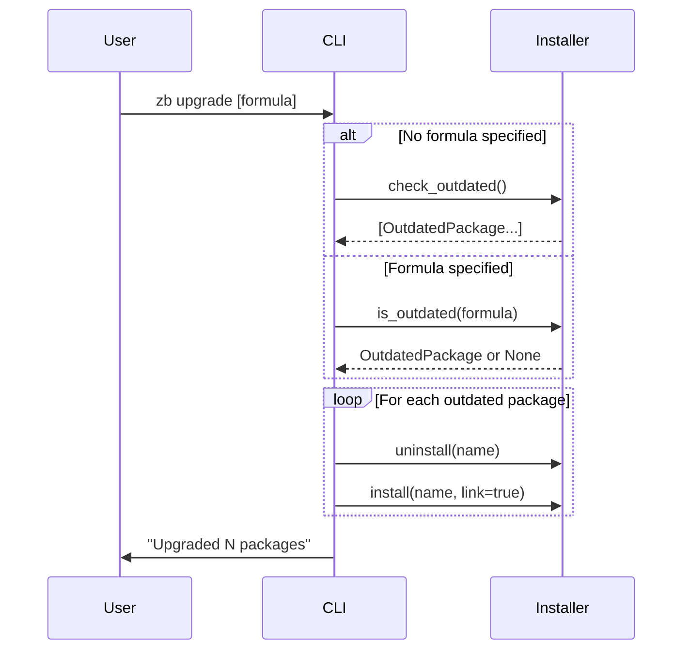

# Detailed Design: Zerobrew Update/Outdated/Upgrade Commands

## Overview

This document describes the design for implementing three new subcommands for zerobrew: `update`, `outdated`, and `upgrade`. These commands complete the core package management workflow, allowing users to refresh package metadata, identify outdated packages, and upgrade them to the latest versions.

The design prioritizes Homebrew CLI compatibility while leveraging zerobrew's existing architecture for performance.

---

## Detailed Requirements

### Scope
- **Phase 1 (this design):** `update`, `outdated`, `upgrade`
- **Phase 2 (future):** `cleanup`, `doctor`

### Functional Requirements

1. **`zb update`**
   - Refresh/clear the API cache to ensure subsequent operations fetch fresh formula metadata
   - No local git repo sync (unlike Homebrew) - zerobrew uses on-demand API fetching
   - Print summary of cache state after completion

2. **`zb outdated`**
   - List installed packages that have newer versions available
   - Use hash-based comparison (installed `store_key` vs current bottle `sha256`)
   - Support flags: `--quiet`, `--verbose`, `--json`
   - Check packages in parallel for performance
   - Warn but continue if individual package checks fail

3. **`zb upgrade [formula...]`**
   - Upgrade all outdated packages (no args) or specific packages (with args)
   - Include outdated dependencies in upgrade
   - Reuse existing install infrastructure
   - Warn but continue if individual upgrades fail

### Non-Functional Requirements

- **Homebrew compatibility:** Match CLI flags and output format
- **Performance:** Parallel API requests using existing concurrency infrastructure
- **Error handling:** Warn-and-continue pattern for resilience

---

## Architecture Overview



---

## Components and Interfaces

### 1. ApiCache Extensions (`zb_io/src/cache.rs`)

Add methods to support cache management:

```rust
impl ApiCache {
    /// Clear all cached entries
    pub fn clear(&self) -> Result<usize, rusqlite::Error>;
    
    /// Clear entries older than specified age
    pub fn clear_older_than(&self, max_age_secs: i64) -> Result<usize, rusqlite::Error>;
    
    /// Get cache statistics
    pub fn stats(&self) -> Result<CacheStats, rusqlite::Error>;
}

pub struct CacheStats {
    pub entry_count: usize,
    pub oldest_entry: Option<i64>,  // timestamp
    pub newest_entry: Option<i64>,  // timestamp
}
```

### 2. Outdated Check Logic (`zb_io/src/install.rs`)

Add methods to the `Installer` struct:

```rust
impl Installer {
    /// Check which installed packages are outdated
    pub async fn check_outdated(&self) -> Result<Vec<OutdatedPackage>, Error>;
    
    /// Check if a specific package is outdated
    pub async fn is_outdated(&self, name: &str) -> Result<Option<OutdatedPackage>, Error>;
}

#[derive(Debug, Clone)]
pub struct OutdatedPackage {
    pub name: String,
    pub installed_version: String,
    pub installed_sha256: String,
    pub current_version: String,
    pub current_sha256: String,
}
```

**Algorithm for `check_outdated`:**
1. Get list of installed packages from database
2. For each package (in parallel):
   - Fetch current formula from API
   - Select appropriate bottle for platform
   - Compare `installed.store_key` with `bottle.sha256`
   - If different, package is outdated
3. Collect and return outdated packages
4. Log warnings for packages that fail to check (network errors, removed formulas)

### 3. CLI Commands (`zb_cli/src/main.rs`)

Add new command variants:

```rust
#[derive(Subcommand)]
enum Commands {
    // ... existing commands ...
    
    /// Refresh package metadata cache
    Update,
    
    /// List outdated packages
    Outdated {
        /// List only names (no version info)
        #[arg(short, long)]
        quiet: bool,
        
        /// Show detailed version information
        #[arg(short, long)]
        verbose: bool,
        
        /// Output in JSON format
        #[arg(long)]
        json: bool,
    },
    
    /// Upgrade outdated packages
    Upgrade {
        /// Specific formula(s) to upgrade (upgrades all if omitted)
        formula: Vec<String>,
        
        /// Show what would be upgraded without upgrading
        #[arg(short = 'n', long)]
        dry_run: bool,
    },
}
```

---

## Data Models

### OutdatedPackage

```rust
#[derive(Debug, Clone, Serialize)]
pub struct OutdatedPackage {
    pub name: String,
    pub installed_version: String,
    pub installed_sha256: String,
    pub current_version: String,
    pub current_sha256: String,
}
```

### CacheStats

```rust
#[derive(Debug, Clone)]
pub struct CacheStats {
    pub entry_count: usize,
    pub oldest_entry: Option<i64>,
    pub newest_entry: Option<i64>,
}
```

### JSON Output Format (for `outdated --json`)

```json
{
  "formulae": [
    {
      "name": "jq",
      "installed_version": "1.6",
      "current_version": "1.7",
      "installed_sha256": "abc123...",
      "current_sha256": "def456..."
    }
  ]
}
```

---

## Data Flow

### Update Command Flow



### Outdated Command Flow



### Upgrade Command Flow



---

## Error Handling

### Error Categories

1. **Network Errors** (during API fetch)
   - Log warning: `"Warning: Could not check {name}: {error}"`
   - Continue with remaining packages
   - Report count of failed checks at end

2. **Missing Formula** (package removed from Homebrew)
   - Log warning: `"Warning: {name} is no longer available in Homebrew"`
   - Continue with remaining packages

3. **Upgrade Failures**
   - Log error for specific package
   - Continue with remaining upgrades
   - Exit with non-zero status if any upgrades failed

### Error Messages

Follow zerobrew's existing style using `console::style`:
```rust
eprintln!("{} Could not check {}: {}", 
    style("Warning:").yellow().bold(), 
    name, 
    error);
```

---

## Testing Strategy

### Unit Tests

1. **ApiCache**
   - `clear()` removes all entries
   - `clear_older_than()` removes only old entries
   - `stats()` returns correct counts

2. **Outdated Detection**
   - Package with same sha256 → not outdated
   - Package with different sha256 → outdated
   - Package with different version but same sha256 → not outdated (rebuild)

### Integration Tests

1. **Update Command**
   - Clears cache successfully
   - Reports correct count

2. **Outdated Command**
   - Returns empty list when all packages current
   - Returns correct list when packages outdated
   - Handles network errors gracefully
   - JSON output is valid

3. **Upgrade Command**
   - Upgrades single package
   - Upgrades all outdated packages
   - Handles partial failures
   - Dry-run shows but doesn't execute

### Mock Server Tests

Use `wiremock` (already in use) to simulate:
- Formula API responses
- Network failures
- Removed packages (404)

---

## Appendices

### A. Technology Choices

| Choice | Rationale |
|--------|-----------|
| Hash-based comparison | Simpler than version parsing, catches rebuilds |
| Parallel API checks | Consistent with zerobrew's performance focus |
| SQLite cache clearing | Atomic operation, existing infrastructure |
| Warn-and-continue | Better UX than failing entire operation |

### B. Homebrew CLI Compatibility

| Homebrew Flag | Zerobrew Support | Notes |
|---------------|------------------|-------|
| `outdated -q/--quiet` | ✓ | Names only |
| `outdated -v/--verbose` | ✓ | Detailed info |
| `outdated --json` | ✓ | Machine-readable |
| `upgrade -n/--dry-run` | ✓ | Preview mode |
| `upgrade --formula` | Implicit | Zerobrew is formula-only |

### C. Research Findings

**Existing Architecture:**
- `ApiClient` fetches from `https://formulae.brew.sh/api/formula/{name}.json`
- `ApiCache` stores responses with ETag/Last-Modified for conditional requests
- `Database` tracks installed packages with `store_key` (sha256)
- `Installer` handles install/uninstall with parallel downloads

**Key Insight:** Zerobrew's stateless design (no local formula repo) means `update` is simpler than Homebrew's - just clear the cache to force fresh API fetches.

### D. Alternative Approaches Considered

1. **Version string comparison for outdated detection**
   - Rejected: Complex parsing, doesn't catch rebuilds
   
2. **Full formula sync (like Homebrew)**
   - Rejected: Against zerobrew's on-demand philosophy
   
3. **In-place upgrade (without uninstall)**
   - Rejected: More complex, existing install handles this cleanly
